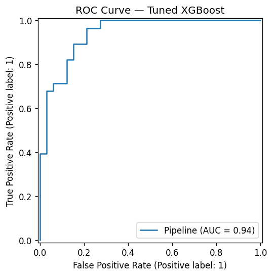
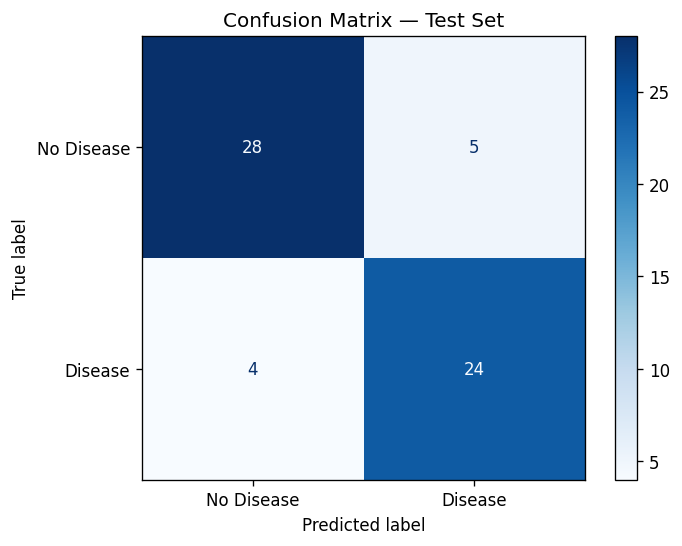
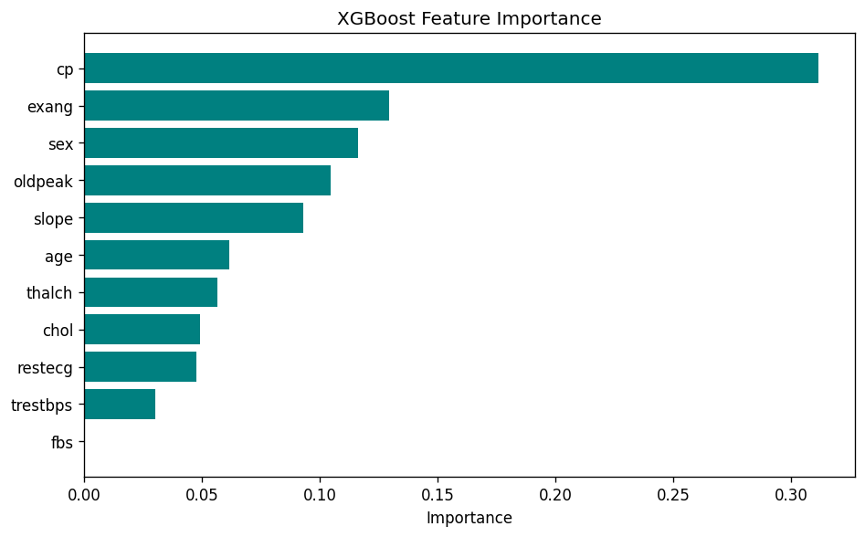

<div align="center">

# ❤️ Heart Disease Risk Prediction

**A leakage-free, end-to-end machine-learning system** that predicts the
presence of heart disease from 11 routine clinical measurements — served as both
a **FastAPI** REST service and an interactive **Streamlit** app, with real
**per-patient SHAP explanations**.

[](https://www.python.org/)
[](https://scikit-learn.org/)
[](https://xgboost.readthedocs.io/)
[](#testing)
[](LICENSE)

</div>

---

## 📋 Table of Contents
- [Overview](#-overview)
- [Demo](#-demo)
- [Key Features](#-key-features)
- [Results](#-results)
- [Architecture](#-architecture)
- [Project Structure](#-project-structure)
- [Installation](#-installation)
- [Usage](#-usage)
- [Deployment](#-deployment)
- [Testing](#-testing)
- [How Data Leakage Was Eliminated](#-how-data-leakage-was-eliminated)
- [Future Improvements](#-future-improvements)
- [License](#-license)

---

## 🩺 Overview

Cardiovascular disease is the leading cause of death worldwide. This project
trains a calibrated classifier on the UCI / Cleveland heart-disease dataset and
exposes it through clean, production-style interfaces. It is built to demonstrate
**the full ML lifecycle** — data validation, leakage-free preprocessing, model
comparison, hyperparameter tuning, explainability, testing, and deployment —
not just a notebook that prints an accuracy score.

> ⚠️ **Disclaimer:** This is an educational project, **not** a medical device.
> It must not be used for real diagnosis.

**Input — 11 clinical features:** `age, sex, cp, trestbps, chol, fbs, restecg,
thalch, exang, oldpeak, slope`
**Output:** `Disease / No Disease` + probability + risk band + SHAP explanation.

---

## 🎬 Demo

| Streamlit demo | FastAPI docs |
| --- | --- |
| `streamlit run app/streamlit_app.py` → http://localhost:8501 | `uvicorn api.main:app` → http://localhost:8000/docs |

> _Add screenshots/GIFs here once deployed (see `docs/SCREENSHOTS.md`)._
> A `Demo.mp4` walkthrough is included in the original submission.

---

## ✨ Key Features

- 🔬 **Leakage-free pipeline** — imputation + scaling live *inside* an sklearn
  `Pipeline`, so they are fit on training folds only. (The original notebook
  imputed the full dataset before splitting — a textbook leak.)
- 🤖 **Model comparison + tuning** — Logistic Regression, Random Forest, SVM and
  XGBoost compared by stratified CV; the winner is tuned with
  `RandomizedSearchCV` and the **tuned** model is the one that ships.
- 🧠 **Real SHAP explanations** — genuine *per-patient* feature contributions
  (the original returned identical global importances for every patient).
- 🛡️ **Robust validation** — every input is range-checked at the API, app and
  service layers via one shared module.
- ⚡ **Two deployment faces** — a typed FastAPI service and a Streamlit UI,
  both Docker-ready.
- ✅ **Tested** — 17 unit/integration tests (`pytest`), CI via GitHub Actions.
- 📦 **Reproducible** — `python -m heart.train` regenerates the model, metrics
  and report plots deterministically.

---

## 📊 Results

Held-out test set (20%, stratified, never seen during training/tuning):

| Metric | Score |
| --- | --- |
| **ROC-AUC** | **0.94** |
| Accuracy | 0.85 |
| Precision | 0.83 |
| Recall (Sensitivity) | 0.86 |
| Specificity | 0.85 |
| F1-score | 0.84 |

**Model comparison (5-fold CV ROC-AUC on training set):**

| Model | CV ROC-AUC |
| --- | --- |
| Logistic Regression | 0.844 |
| SVM | 0.830 |
| Random Forest | 0.819 |
| XGBoost (base) | 0.779 |
| **XGBoost (tuned)** | **0.843** |

> The linear models are competitive on this small (303-row) dataset — a useful
> reminder that complex models aren't always better. XGBoost was selected and
> tuned for its strongest **held-out test ROC-AUC (0.94)** and is the deployed
> model. All numbers are reproduced in [`models/metrics.json`](models/metrics.json).

| ROC Curve | Confusion Matrix | Feature Importance |
| --- | --- | --- |
|  |  |  |

---

## 🏗️ Architecture

```
                          ┌─────────────────────────┐
                          │   data/heart_*.csv       │
                          └───────────┬─────────────┘
                                      │ load + validate (heart.data)
                                      ▼
   ┌──────────────────────────────────────────────────────────────┐
   │  TRAINING  (python -m heart.train)                            │
   │                                                              │
   │   train/test split ─► Pipeline[impute→scale→clf] ─► CV       │
   │   compare models ─► RandomizedSearchCV (XGBoost) ─► refit    │
   │   evaluate on held-out test ─► save artifacts               │
   └───────────────┬──────────────────────────────┬─────────────┘
                   ▼                                ▼
        models/heart_pipeline.joblib       models/metrics.json
        (impute+scale+model in one)        reports/*.png
                   │
        ┌──────────┴───────────┐ load once (cached)
        ▼                      ▼
 ┌──────────────┐      ┌────────────────┐
 │  FastAPI     │      │   Streamlit    │     heart.predict  → prediction
 │  api/main.py │      │ app/streamlit  │     heart.explain  → SHAP
 │  /predict    │      │   _app.py      │     heart.validation → guardrails
 └──────────────┘      └────────────────┘
```

See [`docs/architecture.md`](docs/architecture.md) for a fuller write-up.

---

## 🗂️ Project Structure

```
heart-disease-risk-prediction/
├── src/heart/                 # Installable Python package (the "library")
│   ├── config.py              # Single source of truth: paths, schema, ranges
│   ├── data.py                # Dataset loading + normalisation (no leakage here)
│   ├── pipeline.py            # Model factory: impute→scale→classifier
│   ├── train.py               # Training CLI: compare, tune, evaluate, persist
│   ├── predict.py             # Cached inference service
│   ├── explain.py             # Real per-patient SHAP (with safe fallback)
│   ├── validation.py          # Shared input validation
│   └── logging_conf.py        # Consistent logging
├── api/main.py                # FastAPI REST service (/predict, /health, /docs)
├── app/streamlit_app.py       # Streamlit demo UI
├── tests/                     # pytest suite (17 tests)
├── data/                      # Bundled dataset + sample CSVs
├── models/                    # Trained pipeline + metrics (committed, ~110 KB)
├── reports/                   # Auto-generated evaluation plots
├── notebooks/                 # Original EDA + modelling notebook
├── docs/                      # Architecture, resume, interview prep, setup
├── Dockerfile / docker-compose.yml
├── requirements*.txt · pyproject.toml · Makefile
└── .github/workflows/ci.yml   # Lint + test on every push
```

---

## ⚙️ Installation

> Requires **Python 3.10+**.

```bash
# 1. Clone
git clone https://github.com/JAGHDHEEP/heart-disease-risk-prediction.git
cd heart-disease-risk-prediction

# 2. Create a virtual environment
python -m venv .venv
# Windows:  .venv\Scripts\activate
# macOS/Linux:  source .venv/bin/activate

# 3. Install dependencies
pip install -r requirements-dev.txt   # or requirements.txt for runtime only
```

The trained model is committed, so you can run the apps immediately. To
retrain from scratch:

```bash
# Windows PowerShell:  $env:PYTHONPATH="src"; python -m heart.train
PYTHONPATH=src python -m heart.train          # ~15 seconds
```

---

## 🚀 Usage

### Streamlit demo (recommended for showcasing)
```bash
PYTHONPATH=src streamlit run app/streamlit_app.py
```
Enter a patient's values or upload a CSV → get a prediction + SHAP chart.

### FastAPI service
```bash
PYTHONPATH=src uvicorn api.main:app --reload
```
```bash
curl -X POST http://localhost:8000/predict \
  -H "Content-Type: application/json" \
  -d '{"age":63,"sex":1,"cp":3,"trestbps":145,"chol":233,"fbs":1,
       "restecg":0,"thalch":150,"exang":0,"oldpeak":2.3,"slope":2}'
```
```json
{
  "prediction": "Disease",
  "disease_probability": 92.13,
  "confidence": 92.13,
  "risk_level": "High",
  "explanation": [{"feature": "cp", "value": 3.0,
                   "contribution": 0.0996, "direction": "increases risk"}, ...]
}
```

### Python API
```python
from heart.predict import predict
from heart.explain import explain

patient = {"age": 63, "sex": 1, "cp": 3, "trestbps": 145, "chol": 233,
           "fbs": 1, "restecg": 0, "thalch": 150, "exang": 0,
           "oldpeak": 2.3, "slope": 2}
print(predict(patient))
print(explain(patient, top_k=3))
```

---

## 🐳 Deployment

Full step-by-step guide (Streamlit Cloud, Render, Docker, Hugging Face Spaces)
is in **[`docs/DEPLOYMENT.md`](docs/DEPLOYMENT.md)**. Quick start with Docker:

```bash
docker compose up --build
# API  → http://localhost:8000/docs
# App  → http://localhost:8501
```

---

## 🧪 Testing

```bash
PYTHONPATH=src pytest          # 17 tests
PYTHONPATH=src pytest --cov=heart
ruff check src api app tests   # lint
```

---

## 🔒 How Data Leakage Was Eliminated

The original notebook computed median/mode imputation on the **entire dataset**
*before* the train/test split, then scaled similarly — leaking test-set
statistics into training and inflating reported metrics.

**Fix:** preprocessing is now part of the model object:

```python
Pipeline([("imputer", SimpleImputer(strategy="median")),
          ("scaler",  StandardScaler()),
          ("clf",     XGBClassifier(...))])
```

During `cross_val_score` / `RandomizedSearchCV`, the imputer and scaler are
re-fit on each training fold only. The held-out test set is touched **exactly
once**, at the very end. The saved artifact is this whole pipeline, so inference
applies the identical, correctly-fit transforms.

---

## 🔮 Future Improvements

- Probability **calibration** (`CalibratedClassifierCV`) + decision-threshold
  tuning to favour recall (clinically, false negatives are costlier).
- Train on the **combined UCI dataset** (~920 rows) for better generalisation.
- **MLflow** experiment tracking + model registry.
- **Drift monitoring** and request logging in the API.
- Optional **auth + history** front-end (the original Flask app had login/SQLite;
  re-add as a separate service behind the API).
- Model card + fairness analysis across sex/age subgroups.

---

## 📄 License

Released under the [MIT License](LICENSE).

Dataset: UCI Heart Disease (Cleveland), via the UCI ML Repository / Kaggle.

---

<div align="center">
<sub>Built to demonstrate production ML practices — data integrity, explainability, testing, and deployment.</sub>
</div>
